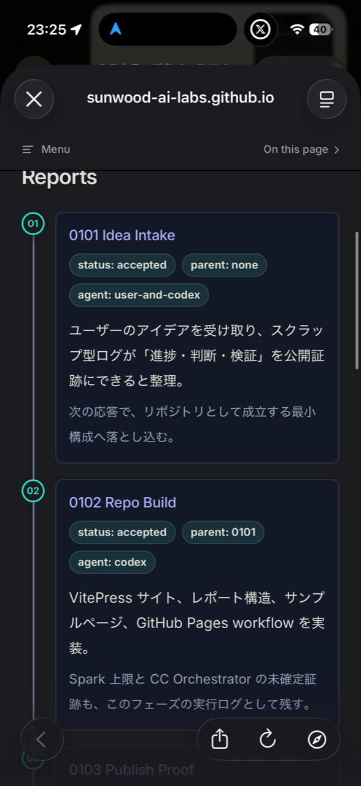

# This Thread: Agent Scrapbook Launch

<div class="thread-intro">

このページは、実際の会話を「スクラップ風のエージェント進捗ログ」に変換した例です。元スレッドでは、ユーザーが「Zenn のスクラップのように、各応答ごとのレポートを末尾へ追加し、タスクをツリー状に可視化したい」と提案しました。

以下のように、各応答や作業フェーズをこのスレッドページの末尾に順番に追加します。このページ自体を正本にして、個別レポートとの二重管理はしません。

</div>

## Reports

<div class="thread">

<article class="thread-report">
  <section class="thread-card">
    <div class="thread-head">
      <div class="thread-dot">01</div>
      <div class="thread-title">
        <h3>0101 Idea Intake</h3>
      </div>
      <div class="thread-meta">
        <span class="thread-chip">status: accepted</span>
        <span class="thread-chip">parent: none</span>
        <span class="thread-chip">agent: user-and-codex</span>
      </div>
    </div>
    <div class="thread-body">
      <h4>受け取った要件</h4>
      <blockquote>Zenn のスクラップのように、各応答ごとのレポートをスレッド末尾に追加して、進捗を可視化したい。</blockquote>
      <h4>判断</h4>
      <ul>
        <li>チャットログではなく、公開できる作業証跡として扱う。</li>
        <li>当初は独立 Markdown も検討したが、後続の指摘によりスレッド正本へ寄せる。</li>
        <li>親子関係を <code>parent</code> で持てば、分岐した調査や修正もあとから追える。</li>
      </ul>
      <h4>次のアクション</h4>
      <pre><code>docs/tasks/&lt;task&gt;.md
docs/reports/NNNN-&lt;report&gt;.md</code></pre>
    </div>
  </section>
</article>

<article class="thread-report">
  <section class="thread-card">
    <div class="thread-head">
      <div class="thread-dot">02</div>
      <div class="thread-title">
        <h3>0102 Repo Build</h3>
      </div>
      <div class="thread-meta">
        <span class="thread-chip">status: accepted</span>
        <span class="thread-chip">parent: 0101</span>
        <span class="thread-chip">agent: codex</span>
      </div>
    </div>
    <div class="thread-body">
      <h4>実装したもの</h4>
      <ul>
        <li>VitePress の公開ドキュメントサイト</li>
        <li>タスクスレッドページと個別レポートページ</li>
        <li>GitHub Pages 用 workflow</li>
        <li>日本語 README と英語 README</li>
      </ul>
      <h4>運用上のメモ</h4>
      <p>各応答は <code>docs/reports/</code> に残し、タスクページには要約とリンクを追記する。これにより、長い作業でも「何が終わり、何が未検証か」を後から見直せる。</p>
      <pre><code>npm run docs:build
gh repo create Sunwood-ai-labs/agent-scrapbook --public</code></pre>
    </div>
  </section>
</article>

<article class="thread-report">
  <section class="thread-card">
    <div class="thread-head">
      <div class="thread-dot">03</div>
      <div class="thread-title">
        <h3>0103 Publish Proof</h3>
      </div>
      <div class="thread-meta">
        <span class="thread-chip">status: accepted</span>
        <span class="thread-chip">parent: 0102</span>
        <span class="thread-chip">agent: codex</span>
      </div>
    </div>
    <div class="thread-body">
      <h4>分けて確認した proof surface</h4>
      <ul>
        <li><strong>Local:</strong> <code>npm run check</code> が成功</li>
        <li><strong>GitHub:</strong> repository visibility が <code>PUBLIC</code></li>
        <li><strong>Actions:</strong> Pages deploy が成功</li>
        <li><strong>Published:</strong> 公開URLが <code>HTTP/2 200</code></li>
      </ul>
      <h4>公開URL</h4>
      <p><a href="https://sunwood-ai-labs.github.io/agent-scrapbook/">https://sunwood-ai-labs.github.io/agent-scrapbook/</a></p>
    </div>
  </section>
</article>

<article class="thread-report">
  <section class="thread-card">
    <div class="thread-head">
      <div class="thread-dot">04</div>
      <div class="thread-title">
        <h3>0104 Example Expansion</h3>
      </div>
      <div class="thread-meta">
        <span class="thread-chip">status: accepted</span>
        <span class="thread-chip">parent: 0103</span>
        <span class="thread-chip">agent: codex</span>
      </div>
    </div>
    <div class="thread-body">
      <h4>追加した実例</h4>
      <ul>
        <li>この会話自体を <code>this-thread-agent-scrapbook</code> として追加</li>
        <li><code>0101</code> から <code>0104</code> までを時系列レポート化</li>
        <li>全文転載ではなく、公開向けの要約として整理</li>
      </ul>
      <h4>この時点の弱点</h4>
      <p>構造はできたが、見た目はまだ「Reports のリンク一覧」に近く、ユーザーが期待したスレッド感には届いていなかった。</p>
    </div>
  </section>
</article>

<article class="thread-report">
  <section class="thread-card">
    <div class="thread-head">
      <div class="thread-dot">05</div>
      <div class="thread-title">
        <h3>0105 Screenshot Review</h3>
      </div>
      <div class="thread-meta">
        <span class="thread-chip">status: superseded</span>
        <span class="thread-chip">parent: 0104</span>
        <span class="thread-chip">agent: user-and-codex</span>
      </div>
    </div>
    <div class="thread-body">
      <h4>ユーザーからの指摘</h4>
      <blockquote>スレッド形式になってなくね？？ ページをスクリーンショットベースで確認した？</blockquote>
      <h4>確認結果</h4>
      <p>指摘どおり、前回はスクリーンショット確認をしていなかった。タイムライン風にはしたが、左レーンが横幅を食い、カード内の情報量も少なかった。</p>
      <figure class="thread-image">
        
        <figcaption>ユーザー指摘時の表示。左のライン列が目立ち、カード本文も薄い。</figcaption>
      </figure>
    </div>
  </section>
</article>

<article class="thread-report">
  <section class="thread-card">
    <div class="thread-head">
      <div class="thread-dot">06</div>
      <div class="thread-title">
        <h3>0106 Wide Markdown Cards</h3>
      </div>
      <div class="thread-meta">
        <span class="thread-chip">status: fixing</span>
        <span class="thread-chip">parent: 0105</span>
        <span class="thread-chip">agent: user-and-codex</span>
      </div>
    </div>
    <div class="thread-body">
      <h4>今回の修正方針</h4>
      <ul>
        <li>カードを横幅いっぱいに使い、左レーンを廃止する。</li>
        <li>カード同士を短いコネクタで連結し、縦スクロールで読みやすくする。</li>
        <li>カード内に <code>h4</code>, <code>ul</code>, <code>blockquote</code>, <code>pre/code</code>, <code>img</code> を入れ、Markdown相当の表現を使えるようにする。</li>
        <li>内容を「要件、判断、検証、弱点、次アクション」まで厚くする。</li>
      </ul>
      <h4>検証すること</h4>
      <pre><code>cards === 6
links include "0106 Wide Markdown Cards"
images >= 1
mobile screenshot looks readable</code></pre>
    </div>
  </section>
</article>

<article class="thread-report">
  <section class="thread-card">
    <div class="thread-head">
      <div class="thread-dot">07</div>
      <div class="thread-title">
        <h3>0107 Responsive Overflow Fix</h3>
      </div>
      <div class="thread-meta">
        <span class="thread-chip">status: accepted</span>
        <span class="thread-chip">parent: 0106</span>
        <span class="thread-chip">agent: user-and-codex</span>
      </div>
    </div>
    <div class="thread-body">
      <h4>ユーザーからの指摘</h4>
      <blockquote>カードとかがレスポンシブ対応してる？ 下のテキスト系はできてるように見えるけどどう？？</blockquote>
      <h4>確認した問題</h4>
      <ul>
        <li>通常テキストは折り返せていた。</li>
        <li>カード、コードブロック、Branch View は長い <code>pre/code</code> に引っ張られ、横スクロールが出る状態だった。</li>
        <li>つまり「本文はレスポンシブ、カード内の固定幅系は未対応」という状態だった。</li>
      </ul>
      <h4>修正</h4>
      <ul>
        <li><code>.thread</code>, <code>.thread-card</code>, <code>.thread-body</code> に <code>min-width: 0</code> と <code>max-width: 100%</code> を追加。</li>
        <li><code>pre</code> と <code>code</code> を <code>pre-wrap</code> / <code>overflow-wrap: anywhere</code> で折り返す。</li>
        <li><code>.thread-branch</code> も同じルールにして、Branch View が画面外へ出ないようにした。</li>
      </ul>
      <h4>検証結果</h4>
      <pre><code>widths: 360, 390, 430
scrollWidth === viewport
cards: 6
codeBlocks: 3
images: 1
overflow failures: 0</code></pre>
    </div>
  </section>
</article>

<article class="thread-report">
  <section class="thread-card">
    <div class="thread-head">
      <div class="thread-dot">08</div>
      <div class="thread-title">
        <h3>0108 Single Source Thread</h3>
      </div>
      <div class="thread-meta">
        <span class="thread-chip">status: accepted</span>
        <span class="thread-chip">parent: 0107</span>
        <span class="thread-chip">agent: user-and-codex</span>
      </div>
    </div>
    <div class="thread-body">
      <h4>ユーザーからの指摘</h4>
      <blockquote>スレッドと個別レポートって同じ？？ スレッドから個別レポートに飛ぶくらいなら、個別レポートレベルの情報をスレッドに載せて！ 二重管理になります！</blockquote>
      <h4>判断</h4>
      <ul>
        <li>指摘どおり、この用途ではスレッドページが正本であるべき。</li>
        <li>個別レポートへのリンクを前提にすると、スレッド側と個別ページ側で内容がずれる。</li>
        <li>この実例スレッドでは <code>docs/reports/010x...</code> を廃止し、全情報をこのページ内カードに集約する。</li>
      </ul>
      <h4>修正</h4>
      <ul>
        <li>カード見出しから個別レポートリンクを削除。</li>
        <li>トップページとサイドバーから <code>010x</code> 個別レポートリンクを削除。</li>
        <li><code>0101</code> から <code>0108</code> までをスレッド内だけで読める構成に変更。</li>
      </ul>
      <h4>今後のルール</h4>
      <pre><code>thread page = source of truth
report card = full report body
separate report page = optional archive only, not default</code></pre>
    </div>
  </section>
</article>

</div>

## Branch View

<div class="thread-branch">

```text
0101 idea-intake
└─ 0102 repo-build
   └─ 0103 publish-proof
      └─ 0104 example-expansion
         └─ 0105 screenshot-review
            └─ 0106 wide-markdown-cards
               └─ 0107 responsive-overflow-fix
                  └─ 0108 single-source-thread
```

</div>

## Thread Notes

- Spark サブエージェントは利用上限で使えなかったため、フォールバック方針を明記した。
- CC Orchestrator は起動したが、team mode の必要証跡が揃わなかったため成果には採用しなかった。
- 公開可否は、ローカルビルド、GitHub Actions、Pages HTTP 200 を別々に確認した。
- 今回の追記では、会話内容をそのまま転載せず、公開向けに要約した。
- スレッドらしさは、HTTP確認だけではなくスクリーンショットで確認する。
- カード内では Markdown 相当の見出し、リスト、引用、コード、画像を扱えるようにする。
- レスポンシブ確認では、本文だけでなくカード、コードブロック、画像、Branch View の横溢れも検証する。
- この実例では、スレッドページを正本にして個別レポートとの二重管理を避ける。
